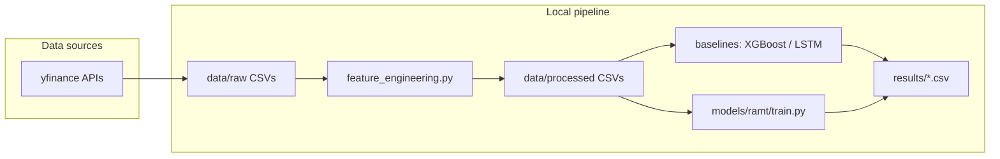

## RAMT — Regime-Adaptive Monthly Stock Ranking (NIFTY)

This repo builds a **Strategic/Tactical hybrid** trading research system:

- **Strategic head (primary)**: a Transformer-based RAMT model ranks NIFTY stocks by expected **next-month outperformance vs NIFTY**.
- **Tactical head (sanity check)**: the same model also predicts **next-day return** to flag “vibe divergence” (e.g., monthly looks good but daily predicts a sharp drop).
- **Regime filter**: a Gaussian **HMM regime label** (Bull / High-Vol / Bear) controls **position sizing** and “risk-off” behavior.

---

## Run the model (every time)

Work from the **repository root**. Use the project virtualenv so `python` matches `requirements.txt`:

```bash
cd /path/to/regime-adaptive-transformer
python3 -m venv .venv          # once per machine
source .venv/bin/activate      # Windows: .venv\Scripts\activate
pip install -r requirements.txt
```

**Full pipeline** (download → features → train + walk-forward + backtest):

```bash
source .venv/bin/activate
python data/download.py
python features/feature_engineering.py
python -m models.run_final_2024_2026
```

Optional **dashboard** (after a successful run):

```bash
./run_dashboard.sh
```

| Step | What it does |
|------|----------------|
| `data/download.py` | Fetches/updates raw OHLCV parquets under `data/raw/`. |
| `features/feature_engineering.py` | Builds processed parquets in `data/processed/` (features, `HMM_Regime`, **`Sector`**, **`Sector_Alpha`**, `Monthly_Alpha`, …). **Run this after any change to feature code or when you need fresh labels.** |
| `python -m models.run_final_2024_2026` | Fits scalers + trains RAMT walk-forward, writes predictions and backtest CSVs under `results/`. |

**Model-only rerun** (processed data unchanged): skip download; only run `models.run_final_2024_2026`. If training fails with missing **`Sector_Alpha`** / **`Sector`**, re-run **`features/feature_engineering.py`** end-to-end so the panel step fills sector-neutral targets.

**Notebook (optional):** `RAMT_Monolith_Trainer.ipynb` mirrors the same training stack for an all-in-one environment; keep it in sync with `models/ramt/train_ranking.py` when you change architecture.

**Artifacts in `results/`** (typical):

- `ranking_predictions.csv`, `monthly_rankings.csv`, `backtest_results.csv`
- `ramt_model_state.pt`, `ramt_scaler.joblib`, `ramt_y_scaler.joblib` (for inference, dashboards, attention tools)

**Note:** After architecture changes, old `ramt_model_state.pt` checkpoints may not load; retrain with the command above.

---

## What exactly is the model predicting?

### Strategic (monthly ranking target)
- **`Monthly_Alpha`** = (stock forward 21-trading-day log return) − (NIFTY forward 21-trading-day log return) — benchmark-relative outperformance.
- **`Sector_Alpha`** = `Monthly_Alpha` minus the **median `Monthly_Alpha` in the same (date, sector) cohort** — used as the primary training target when processed parquets include it (see `features/feature_engineering.py`). If `Sector_Alpha` is absent, the loader falls back to **`Monthly_Alpha`**.
- **`Monthly_Alpha_Z`** = `Monthly_Alpha / trailing_21d_vol` (risk-adjusted variant; used in some audits / `permutation_importance` examples).

### Tactical (daily sanity-check target)
- **`Daily_Return`** = next-day `Log_Return` (shifted by -1)

See: `FEATURES_AND_REGIMES.md` for the full feature list and regime explanation.

---

## Portfolio strategy (what a human does)

Every rebalance date (every **21 trading days** on the NIFTY calendar):

1. Read NIFTY **HMM regime**:
   - **Bull**: invest 100%, buy top 5
   - **High-Vol**: invest 50%, buy top 3
   - **Bear**: hold cash
2. Buy the top-ranked stocks (by RAMT strategic score) and hold for the window.
3. Risk rules during the window (in backtest):
   - per-stock **stop loss** (default 7%)
   - max weight per stock (default 20%)
   - portfolio drawdown trigger → force cash next window (default 15%)
4. Friction modeled (new):
   - trade cost bps + slippage bps deducted based on turnover

---

## Explainability: attention inspection (“Why filter”)

We can inspect which days in the 30-day window the Transformer attends to.

After running `models/run_final_2024_2026.py`, run:

```bash
.venv/bin/python models/inspect_attention.py --ticker TCS_NS --date 2024-10-09 --out-prefix tcs_2024_10_09
.venv/bin/python models/attention_consistency_report.py --ticker TCS_NS --n 12
```

Docs: `ATTENTION_EXPLAINABILITY.md`

---

## Feature importance audit (permutation importance)

Use this to see if features like USD/INR, gold, VIX, etc. are actually helping.

```bash
.venv/bin/python models/permutation_importance.py --target Monthly_Alpha_Z --max-samples 8000
```

This writes `results/permutation_importance.csv` and prints top/bottom features.

---

## Repository structure (current)

```
regime-adaptive-transformer/
├── data/
│   ├── download.py
│   ├── raw/
│   └── processed/
├── features/
│   └── feature_engineering.py
├── models/
│   ├── backtest.py
│   ├── inspect_attention.py
│   ├── attention_consistency_report.py
│   ├── permutation_importance.py
│   ├── run_final_2024_2026.py
│   └── ramt/
│       ├── dataset.py
│       ├── encoder.py
│       ├── moe.py
│       ├── model.py
│       ├── losses.py          # TournamentRankingLoss + CombinedLoss
│       └── train_ranking.py   # walk-forward training, sector / y-scaler
├── dashboard/
│   └── app.py
├── FEATURES_AND_REGIMES.md
├── ATTENTION_EXPLAINABILITY.md
├── FEATURES_AND_REGIMES.md
├── requirements.txt
└── README.md
```

---

## Learning Log (keep updating this)

This section is intentionally “journal style”: **what changed** and **why**.

### 2026-04-15 — Pivot: monthly ranking (vs daily prediction)
- **Change**: switched target to `Monthly_Alpha` (21d stock return − 21d NIFTY return).
- **Why**: daily returns are extremely noisy; ranking relative performance is more stable and directly actionable for portfolio construction.

### 2026-04-15 — Added relative momentum + macro features
- **Change**: added `RelMom_*` vs NIFTY and macro returns (USDINR, crude, gold, USVIX).
- **Why**: momentum is a documented anomaly; macro series help explain sector sensitivity (e.g., USDINR for IT).

### 2026-04-15 — Multi-ticker training with ticker embeddings
- **Change**: combined training across the stock universe; added per-ticker embedding.
- **Why**: increases sample count and lets model learn cross-stock patterns while still knowing “which stock” it’s scoring.

### 2026-04-15 — Ranking-first loss (LambdaRank → MarginRanking)
- **Change**: shifted monthly objective to a true ranking loss (order matters more than exact alpha).
- **Why**: trading cares that “A > B”, not the precise 2% gap; ranking losses reduce flat regression behavior on noisy targets.

### 2026-04-15 — Distance-based technical features (scale-free indicators)
- **Change**: replaced absolute technical indicator levels with scale-free “distance” features:
  - RSI uses `RSI_Z` (rolling z-score)
  - Bollinger uses `BB_Dist_Upper` / `BB_Dist_Lower` instead of `BB_Upper` / `BB_Lower`
- **Why**: makes ₹100 and ₹5000 stocks look comparable; reduces noise from absolute price scale and helps the Transformer + RobustScaler focus on patterns not price level.

### 2026-04-15 — MPS (Metal) acceleration on Apple Silicon
- **Change**: training now prefers `mps` device when available (then `cuda`, then `cpu`).
- **Why**: on M2 Macs, using Metal GPU is typically faster and avoids CPU/RAM bottlenecks for Transformers.

### 2026-04-15 — Added market friction + turnover cost model
- **Change**: backtest now subtracts bps cost + slippage based on estimated turnover.
- **Why**: most retail backtests fail in India by ignoring STT/slippage; turnover-aware realism is required.

### 2026-04-15 — Risk-adjusted target `Monthly_Alpha_Z`
- **Change**: added `Monthly_Alpha_Z = Monthly_Alpha / trailing_21d_vol` and use it in the final runner.
- **Why**: avoids “junk” picks that outperform only through extreme volatility; prefers smoother outperformance.

### 2026-04-15 — Dual-brain model (strategic + tactical heads)
- **Change**: model now outputs monthly ranking score + daily return sanity-check.
- **Why**: if daily head screams “crash” while monthly head is bullish, it’s a divergence worth investigating before deploying capital.

### 2026-04-15 — Attention explainability + consistency audit
- **Change**: added attention heatmaps + cross-date consistency report.
- **Why**: explainability is a defense against overfitting; attention should show stable patterns rather than random focus.

---

## Notes
- This is a **research system**, not financial advice.
- For reproducibility, prefer `.venv/bin/python ...` commands.

**Last updated:** 2026-04-16

| Tool | Role | Why we use it | Alternatives | Why this choice here |
|------|------|---------------|--------------|----------------------|
| **Python 3** | Language | Ecosystem for ML, data, and PyTorch | R, Julia | Broad libraries, hiring signal, PyTorch-first DL |
| **NumPy / Pandas** | Arrays & time series | Fast columnar ops, alignment | Polars | Pandas ubiquitous for finance tutorials and team familiarity |
| **yfinance** | OHLCV download | Free, simple | Polygon, Refinitiv | Zero API keys for coursework/research |
| **scikit-learn** | Scaling, metrics, splits | `RobustScaler` (IQR), metric helpers | — | Industry default for preprocessing |
| **XGBoost** | Gradient boosted trees baseline | Strong tabular performance, fast | LightGBM, CatBoost | Mature, well-documented; easy to justify |
| **hmmlearn** | Gaussian HMM | Regime discovery from returns/vol | Bayesian HMM, HDP-HMM | Simple, fits pipeline scope |
| **PyTorch** | Deep learning | Dynamic graphs, research flexibility | TensorFlow/JAX | Standard for custom architectures (MoE, encoders) |
| **Matplotlib / Seaborn** | EDA plots | Publication-style plots | Plotly | Notebook-friendly |
| **SciPy / statsmodels** | Stats / diagnostics | Complements EDA | — | Optional depth in notebooks |
| **Jupyter** | Exploratory work | Interactive EDA | VS Code only | Standard for quantitative research |

**Not used in this repo (by design):**

| Category | Note |
|----------|------|
| **Backend / REST API** | No FastAPI/Flask service; batch inference via scripts. |
| **Database** | Data on disk as CSV; no PostgreSQL/Redis. |
| **Cloud SDK** | No vendor lock-in; run locally or bring your own container. |
| **Dedicated experiment tracking** | No Weights & Biases / MLflow in `requirements.txt`; easy to add. |

---

## 5. System architecture

This project is a **batch ML pipeline**, not a client-server product. There is **no frontend** in the repository.



### Model training pipeline (RAMT)

1. **Load** processed features for ticker `T` → `RAMTDataModule`.  
2. **Define folds** (`get_walk_forward_indices`): expanding train, fixed step test.  
3. **Per fold:** split train into train/val; **fit scaler on train**; build `DataLoader`s.  
4. **Initialize** `RAMTModel` (fresh weights per fold in `train.py`).  
5. **Optimize** `CombinedLoss` with **AdamW**, **cosine warm restarts**, **gradient clipping**, **early stopping** on validation loss.  
6. **Predict** on test window; append to out-of-sample CSV.

### Inference pipeline

- **Inference = same forward pass** as training without gradients: `model(X, regime)` → prediction + gates. Implemented in `predict()` inside `models/ramt/train.py`. No separate GPU serving layer.

### Data flow (conceptual)

```
Raw OHLCV → engineered features + regimes → scaled sequences → encoder → +position → MoE → ŷ
                                              ↑
                                    regime labels (parallel path)
```

---

## 6. Dataset

### Source & format

- **Source:** Public market data via **`yfinance`** (`data/download.py`).  
- **Format:** Per-ticker CSV under `data/processed/` named `{TICKER}_features.csv` (e.g. `JPM_features.csv`, `RELIANCE_NS_features.csv`). **Git ignores** `data/processed/*.csv` by default (large files).

### Scale (approximate)

- **Horizon:** Configurable; default download window is roughly **2010–2026** for most tickers (see `data/download.py`; EPIGRAL uses a shorter window).  
- **Rows:** Order of **thousands** of trading days per ticker after cleaning (exact count depends on listing and NaN drop). Example: ~**3.9k** rows for JPM in development logs.  
- **RAMT input width:** **10** numeric features (`ALL_FEATURE_COLS` in `models/ramt/dataset.py`). The full engineered Parquet table has **more columns** (OHLCV, `Realized_Vol_20`, etc.); RAMT uses this **10-column** lean subset consistently in `MultimodalEncoder`.

### Features & labels

- **Features (groups):** lagged returns, realized volatility, Garman–Klass, vol ratio, RSI/MACD/Bollinger, momentum/ROC, volume ratios, **HMM_Regime**, **Rolling_Corr_Index** (see `features/feature_engineering.py` and `README` feature table below).  
- **Label:** **Next-day** log return (`Log_Return` shifted), aligned so each `(X, y)` pair is **causal**.

### Data quality & risks

| Topic | Practice in this repo |
|-------|------------------------|
| **Missing values** | Engineering uses rolling windows; early rows may drop; pipeline aligns with supervised target. Phase 2 plan notes **zero NaNs** target in processed CSVs after completion. |
| **Class imbalance** | **Regression** task; not class-balanced. XGBoost baseline may use **sample weights** on large moves (`baseline_xgboost.py`). |
| **Noise** | Returns are **high noise**; metrics emphasize **robust** measures (DA%, Sharpe proxy) alongside RMSE. |
| **Bias / survivorship** | Single-name equities; **not** a universe study—results **do not** claim market-wide generalization without further work. |
| **Corporate actions** | Yahoo-adjusted prices typical via yfinance; **verify** for production use. |

### Train / validation / test logic

- **Blind production split (Parquet / `train_ranking`):** Training **2015–01-01 … 2022–12-31** (“history”); strict held-out test **2023–01-01 … 2026–04-15** (“real world”). `RobustScaler` for features and monthly labels is **fit only** on training keys—no 2023+ statistics leak into normalization (`LazyMultiTickerSequenceDataset` applies `transform` per batch). See `models/run_final_2024_2026.py`.
- **Walk-forward (single-ticker / legacy):** Initial train fraction (e.g. **60%** of timeline), then **rolling test** blocks (e.g. **63** days), train expanding. **No random shuffle** of dates.  
- **Validation:** Held out from the **training** segment of each fold (e.g. last **15%** of train indices in `RAMTDataModule.get_fold_loaders`, or mid-2022–end-2022 for the combined trainer).  
- **Why these ratios:** They balance **enough history** to fit regimes/scaler with **many out-of-sample tests**—standard in finance backtesting (not arbitrary 80/10/10 i.i.d. splits).

---

## 7. Data preprocessing

| Step | What | Why | Effect |
|------|------|-----|--------|
| **Returns** | Log returns from closes | Stationarity-ish, scale-free | Stable inputs across tickers |
| **Rolling indicators** | Vol, RSI, MACD, Bollinger, etc. | Encode momentum, risk, positioning | Nonlinear market state |
| **HMM** | Gaussian HMM on selected series | Discrete **regime** proxy | Allows regime features + gating |
| **Cross-asset correlation** | Rolling corr vs benchmark | Context for single-stock moves | Extra context feature |
| **Scaling (RAMT/LSTM)** | `RobustScaler` **fit on train only** (features + monthly label); applied at batch/inference time | Comparable feature scales for neural nets | **Prevents leakage** from test into normalization |
| **Sequence construction** | Last `seq_len` days → `X` | Temporal context for transformers/LSTM | Standard sequence modeling |
| **Regime in RAMT** | Integer embedding + column in `X` | Categorical vs continuous treatment | Avoids false ordinality in embedding path |

**Outliers:** No aggressive winsorization in core scripts; **financial extremes** are often informative—mitigated by **scaling**, **regularization**, and **walk-forward** testing.

---

## 8. Machine learning concepts used

**Extended definitions:** (glossary docs directory is currently not present in-tree; rely on this README + code as source of truth).

| Concept | Definition / role | Applied here |
|---------|-------------------|--------------|
| **Supervised learning** | Learn \(f(X) \approx y\) from pairs | Next-day return regression |
| **Regression** | Continuous target | RMSE, MAE |
| **Bias–variance** | Underfit vs overfit tradeoff | Walk-forward + early stopping + dropout |
| **Overfitting** | Memorizing noise | Mitigated by **val early stopping**, **regularization**, **simple baselines** |
| **Cross-validation** | Not i.i.d. k-fold | **Walk-forward** only—time order preserved |
| **Feature engineering** | Domain inputs vs raw prices | Lags, vol, technicals, HMM, correlation |
| **Hyperparameters** | Config outside training | Learning rate, heads, experts, `lambda_dir` in scripts |
| **Ensemble** | Combine models | **MoE** = weighted ensemble of **experts** (learned weights) |
| **Regularization** | Penalize complexity | Weight decay, dropout, gradient clipping |
| **Evaluation metrics** | Success criteria | RMSE/MAE for fit; **DA%** for direction; **Sharpe/Calmar** for risk-adjusted narrative |

---

## 9. Deep learning concepts used

**Extended definitions:** (glossary docs directory is currently not present in-tree; rely on this README + code as source of truth).

| Concept | Theory (brief) | In this codebase |
|---------|----------------|------------------|
| **Neural network** | Composed linear + nonlinear layers | Encoders, experts, gates |
| **Layers** | Linear, LayerNorm, Dropout, etc. | `encoder.py`, `moe.py`, `model.py` |
| **Activations** | ReLU, softmax | ReLU in MLPs; **softmax** on expert gates |
| **Forward pass** | Compute ŷ from X | `RAMTModel.forward` |
| **Backpropagation** | Chain rule for gradients | `loss.backward()` in training |
| **Optimizers** | AdamW (default in RAMT train) | Weight decay for regularization |
| **Loss** | MSE + directional penalty | `CombinedLoss` |
| **Transformer** | Self-attention over sequence | `ExpertTransformer` uses `nn.TransformerEncoder` |
| **LSTM** | Recurrent baseline | `baseline_lstm.py` |
| **Dropout** | Random unit drops | Encoders, MoE, positional dropout |
| **Layer normalization** | Stabilize activations | Throughout encoder/MoE |
| **Embeddings** | Discrete → vector | **Regime** embedding; **positional** embedding |
| **Attention** | Weighted aggregation over time | Transformer encoder in each expert |
| **MoE** | Multiple experts + router | `MixtureOfExperts` + `GatingNetwork` |

**Transfer learning** is **planned** as cross-market transfer in project docs; the current training script is **per-ticker** walk-forward (verify `train.py` for any multi-ticker joint training).

---

## 10. Model selection reasoning

| Model | Status | Rationale |
|-------|--------|-----------|
| **XGBoost** | Implemented | Strong **tabular** baseline, fast, interpretable feature importance. |
| **LSTM** | Implemented | Classic **sequence** baseline without attention/MoE complexity. |
| **RAMT** | Implemented | Tests hypothesis: **structured multimodal fusion** + **regime routing** helps vs single trunk. |
| **Pure ARIMA / linear** | Not emphasized | Baseline gap for nonlinear multivariate setup. |
| **Single transformer** | Subsumed | Experts **are** transformers; MoE adds **capacity** without one giant model. |

**Tradeoffs:** RAMT has **more parameters** and **longer train** per fold than XGBoost; **interpretability** comes from **gates** and **regimes** vs tree **feature importance**. Speed vs accuracy is **tunable** (embed dim, layers, experts).

---

## 11. Training process (RAMT)

Configured in `models/ramt/train.py` (subject to change in code):

| Item | Typical value | Purpose |
|------|----------------|--------|
| **Epochs** | Up to 50 | Enough to converge with early stopping |
| **Batch size** | 32 | Standard GPU/CPU balance |
| **Learning rate** | 1e-3 | AdamW default scale |
| **Weight decay** | 1e-4 | L2 regularization |
| **Scheduler** | CosineAnnealingWarmRestarts | Escape local minima |
| **Early stopping** | Patience 10 on **val loss** | Reduce overfit |
| **Gradient clip** | 1.0 | Stability with transformers |
| **Hardware** | CPU or CUDA if available | `DEVICE = cuda if available` |
| **Checkpoints** | Directory `checkpoints/` created; **best weights per fold** held in memory | Full walk-forward retrain each fold by default |
| **Experiment tracking** | Console + CSV | Add W&B/MLflow if needed |

**Training time** depends on CPU/GPU, number of folds, and ticker length—not fixed in README.

---

## 12. Evaluation & results

### Metrics

| Metric | Meaning | Why it matters |
|--------|---------|----------------|
| **RMSE / MAE** | Error magnitude | Standard regression fit |
| **DA%** | % correct **sign** | Directional trading relevance |
| **Sharpe** (proxy) | Risk-adjusted return of simple strategy using **predictions as sizing** | Sanity check beyond raw error |
| **MaxDD / Calmar / Profit Factor** | Risk and payoff asymmetry | From `compute_metrics` in `train.py` |

**Confusion matrix:** Not primary for **regression**; direction could be turned into binary classification for extra analysis (not automated in `evaluate.py`).

### Published baseline snapshot (XGBoost, walk-forward)

Illustrative numbers from the project README history (re-run after data refresh):

| Ticker | RMSE | MAE | DA% | Sharpe |
|--------|------|-----|-----|--------|
| JPM | 0.0194 | 0.0127 | 52.13 | 0.52 |
| RELIANCE.NS | 0.0180 | 0.0121 | 52.25 | 0.54 |
| TCS.NS | 0.0151 | 0.0106 | 53.44 | 0.82 |
| HDFCBANK.NS | 0.0165 | 0.0111 | 51.52 | 0.04 |
| EPIGRAL.NS | 0.0243 | 0.0166 | 51.32 | -0.56 |
| **Average** | **0.0187** | **0.0126** | **52.13** | **0.27** |

**RAMT** results are written to `results/ramt_predictions.csv` when running `models/ramt/train.py`; compare against baselines on the **same walk-forward philosophy**.

**Interpretation:** ~**52% directional accuracy** is only slightly above coin flip—**realistic** for daily returns. The project demonstrates **rigorous methodology** more than guaranteed alpha.

---

## 13. Folder structure

```
regime-adaptive-transformer/
├── data/
│   ├── download.py           # Download OHLCV + benchmarks → data/raw/
│   ├── raw/                  # Raw CSVs (gitignored)
│   └── processed/            # Engineered features per ticker (gitignored)
├── features/
│   └── feature_engineering.py  # HMM, technicals, correlation → processed/
├── eda/
│   ├── eda.ipynb             # Exploration
│   └── plots/                # Figures / summary exports
├── models/
│   ├── baseline_xgboost.py   # Walk-forward XGBoost
│   ├── baseline_lstm.py      # Walk-forward LSTM
│   └── ramt/
│       ├── dataset.py        # Column defs, RAMTDataModule, sequences
│       ├── encoder.py        # Multimodal + regime encoders
│       ├── moe.py            # Positional encoding, experts, gating, MoE
│       ├── model.py          # Full RAMTModel
│       ├── losses.py         # MSE + directional
│       └── train_ranking.py  # Monthly ranking training + CSV export
├── FEATURES_AND_REGIMES.md   # Monthly target/features + HMM regime notes
├── results/                  # Predictions & metric tables (gitignored CSVs)
├── checkpoints/              # Saved weights (optional; .gitkeep pattern in .gitignore)
├── evaluate.py               # Summarize baseline predictions CSV
├── requirements.txt
├── README.md                 # This file (project entry point)
├── docs/                     # (currently empty / optional)
└── Phase1_report.tex / .pdf  # Academic reporting artifacts
```

---

## 14. Installation guide

### Prerequisites

- **Python 3.10+** recommended (project uses modern typing; venv may use 3.14 per environment).  
- **Git**  
- Optional: **CUDA** for faster PyTorch training

### Steps

After cloning this repository from your Git hosting provider:

```bash
cd regime-adaptive-transformer

python3 -m venv .venv
source .venv/bin/activate   # Windows: .venv\Scripts\activate

pip install -r requirements.txt
```

### Data

```bash
python data/download.py
python features/feature_engineering.py
```

Processed CSVs appear under `data/processed/`. **No `.env` file is required** for the default Yahoo pipeline.

---

## 15. Usage guide

### Baselines

```bash
# XGBoost walk-forward; writes predictions under results/
python models/baseline_xgboost.py

python evaluate.py   # aggregates results/xgboost_predictions.csv if present
```

```bash
python models/baseline_lstm.py
```

### RAMT (full walk-forward)

```bash
python -m models.ramt.train
# or
python models/ramt/train.py
```

Outputs: **`results/ramt_predictions.csv`**, console metric table.

### Monthly ranking (NIFTY-50-style, combined training)

```bash
python -m models.ramt.train_ranking
```

Outputs: **`results/ranking_predictions.csv`** (if the processed CSVs contain `Monthly_Alpha` and are present for many tickers).

### Dashboard (optional)

There is a Streamlit dashboard under `dashboard/app.py` that visualizes predictions and regimes. It currently expects:

- `data/processed/{TICKER}_features.csv`
- one or more of: `results/xgboost_predictions.csv`, `results/lstm_predictions.csv`, `results/ramt_predictions.csv`
- optional: `results/monthly_rankings.csv` for the monthly portfolio view (may not exist yet)

Run:

```bash
./run_dashboard.sh
```

### Module tests (sanity checks)

```bash
python -m models.ramt.dataset
python -m models.ramt.encoder
python -m models.ramt.moe
python -m models.ramt.model
```

### API / UI

- **None** in-repo. Batch inference is via **Python scripts** and **saved CSVs**.

### Retraining on new data

1. Refresh raw data (`download.py`).  
2. Rebuild features (`feature_engineering.py`).  
3. Re-run baselines and/or `train.py`.

---

## 16. Deployment, scaling & operations

| Aspect | Current state | Production-oriented path |
|--------|----------------|---------------------------|
| **Deployment** | Research scripts | Export **TorchScript** or **ONNX**; wrap in **FastAPI** for internal batch scoring |
| **Containerization** | Not in-repo | Add `Dockerfile` (Python + CUDA optional), pin `requirements.txt` |
| **Cloud** | Local | S3 for data, SageMaker/Vertex for training |
| **CI/CD** | Not configured | GitHub Actions: lint, unit tests, smoke `python -m models.ramt.model` |
| **Scaling inference** | N/A | **Batch** job per universe; **streaming** needs online feature pipeline |
| **Monitoring** | Manual CSV | Track **prediction drift**, **regime distribution**, **Sharpe** in production |

---

## 17. Challenges faced

| Challenge | Mitigation |
|-----------|------------|
| **Non-stationarity** | Walk-forward, regime features, regularization |
| **Leakage** | Scaler fit on train only per fold |
| **Volatile small caps** | EPIGRAL shows weaker metrics—documented honestly |
| **Transformer stability** | Pre-norm encoder, grad clip, dropout |
| **Class imbalance (regression)** | Directional loss + finance metrics |

---

## 18. Future improvements

- **Unified experiment tracking** (W&B, MLflow).  
- **Hyperparameter search** (Optuna) with walk-forward CV.  
- **Attention visualization** and **gate analysis** dashboards.  
- **Cross-market transfer** training (multi-ticker joint or pretrain/finetune).  
- **Production API** + **Docker** + **scheduled retraining**.  
- **Explainability** (SHAP on baselines; gate attribution for RAMT).  
- **License file** and **contributing guidelines** for open-source release.

---

## 19. Resume / recruiter section

**Why this project stands out**

- Demonstrates **end-to-end ML engineering**: data acquisition, **feature engineering with HMM**, **time-series validation that is not naive k-fold**, **multiple model families**, and **deep learning architecture design** (multimodal encoders, transformers, MoE).  
- Shows awareness of **finance-specific pitfalls** (leakage, direction vs magnitude, Sharpe).  
- **Code organization** matches how research teams structure repos (modules, scripts, docs).

**Skills demonstrated**

- Python, PyTorch, scikit-learn, XGBoost, pandas  
- **Time-series ML**, **walk-forward validation**, **metrics** beyond accuracy  
- **Transformer architecture**, **MoE**, **embeddings**, **regularization**  
- Technical writing (**README**, workflow, architecture docs)

**Business relevance**

- Quantitative finance and **model risk** contexts value **transparent methodology** and **honest metrics** over overclaimed accuracy.

---

## 20. Contributing & license

### Contributing

1. Fork the repository.  
2. Create a branch for your change.  
3. Keep commits focused; match existing style.  
4. Run module self-tests after changes to `models/ramt/*`.  
5. Open a pull request with a clear description of motivation and validation.

### License

No `LICENSE` file is present in the repository as of this writing. Before public distribution or reuse, **add an explicit open-source license** (e.g. **MIT** for permissive academic use) and ensure **data terms** from Yahoo/vendors are respected.

---

## Team & institution

| Name | Role |
|------|------|
| Vivek (230119) | Literature review, LaTeX report, theory |
| Shivansh Gupta (230054) | Data pipeline, feature engineering, models |

**Institution:** B.Tech Computer Science and Artificial Intelligence, Rishihood University, Sonipat, India.

---

## Feature groups (reference)

| Group | Examples | Purpose |
|-------|----------|---------|
| Lagged returns | Return_Lag_1 … 20 | Price memory |
| Volatility | Realized vol, Garman–Klass, vol ratio | Risk regime |
| Technical | RSI, MACD, Bollinger | Short-horizon positioning |
| Momentum | Momentum_5/20/60, ROC_10 | Trend |
| Volume | Volume_MA_Ratio, Volume_Log | Participation |
| HMM | HMM_Regime | Latent state |
| Cross-asset | Rolling_Corr_Index | Benchmark context |

---

*This README describes the repository as implemented; scripts and hyperparameters may evolve—prefer reading source files for authoritative behavior.*

**Last updated:** 2026-04-16
