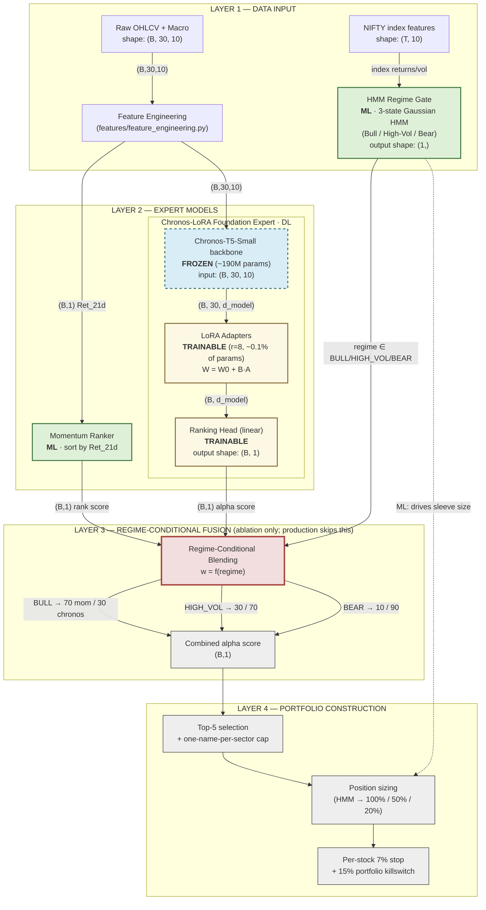

# Architecture — Foundation-Hybrid with Regime-Conditional Gating

This is the **as-deployed-and-ablated** architecture: a Chronos-T5 foundation model fine-tuned with LoRA adapters serves as the DL alpha source, classical 21-day momentum acts as a parallel ML alpha source, and a 3-state HMM gates the blend by regime. The blend in production is currently fixed (Momentum + HMM only); the three-way fusion is run only as part of the ablation.

Conventions in the diagram:
- `B` = batch (universe-on-date), here ~200 NIFTY 200 names per rebalance.
- Boxes labelled **FROZEN** carry zero gradient (Chronos-T5 backbone, ~190M params).
- Boxes labelled **TRAINABLE** carry gradient (LoRA adapters, r=8, ~0.1% of parameters).
- Boxes labelled **ML** are classical statistical components (HMM, momentum sort).
- Boxes labelled **DL** are neural components (Chronos backbone + LoRA + ranking head).
- Edge labels carry tensor shapes where the shape is informative.



### Legend

| Style | Meaning |
| --- | --- |
| Green fill, solid stroke | **ML component** — classical, gradient-free at inference (HMM, momentum sort) |
| Blue fill, dashed stroke | **DL component, frozen** (Chronos-T5 backbone, ~190M params, no gradient) |
| Yellow fill, solid stroke | **DL component, trainable** (LoRA adapters r=8, ranking head — together ~0.1% of total parameters) |
| Red fill, thick stroke | **Regime-conditional fusion gate** (ablation pathway) |

### Key tensor shapes

| Edge | Shape | Note |
| --- | --- | --- |
| Raw → Feature Engineering | `(B, 30, 10)` | 30-day window, 10 engineered features per ticker |
| FE → Chronos backbone | `(B, 30, 10)` | one sequence per ticker per rebalance date |
| Chronos → LoRA | `(B, 30, d_model)` | hidden states from frozen encoder |
| LoRA → Head | `(B, d_model)` | pooled representation |
| Head → Fusion | `(B, 1)` | scalar alpha score per ticker |
| Momentum → Fusion | `(B, 1)` | scalar 21-day return rank |
| HMM → Fusion / Sizing | `(1,)` | one regime label per rebalance date, broadcast across B |

### Trainable vs frozen parameter counts

| Module | Parameters | Trainable? |
| --- | --- | --- |
| Chronos-T5-Small backbone | ~190M | Frozen |
| LoRA adapters (r=8) | ~0.1% of backbone (~190k) | Trainable |
| Ranking head | small (linear) | Trainable |
| HMM (3-state Gaussian on NIFTY) | ~30 (means, covs, transition) | Fit once via Baum-Welch |
| Momentum ranker | 0 | Pure sort |

### Production vs ablation

The **production** deployment uses `models/momentum_hmm_strategy.py` — Layer 1 → Momentum → Layer 4 (top-5 + sector cap + HMM sizing + stops). It does not currently call Chronos-LoRA at inference time. Sharpe 0.83 / CAGR 13.5% on the 2024–2026 window.

The **ablation** path runs all four scenarios in `results/ablation_summary.json` using the diagnostic harness `scripts/run_diagnostic_ablation.py`. Foundation-Only Chronos-LoRA produced the highest Sharpe (1.34) on this window; the regime-gated Triple-Expert produced the lowest (0.54). HMM gating is a win in crisis windows and a drag in clean bulls — see `results/backtesting/hmm_ablation/`.

### SVG / PNG export

Source-of-truth is the Mermaid block above. To regenerate the PNG / SVG used by the dashboard and README:

```bash
# Requires mermaid-cli: npm i -g @mermaid-js/mermaid-cli
mmdc -i docs/architecture.md -o docs/architecture_final.svg
mmdc -i docs/architecture.md -o docs/architecture_final.png
```

`mmdc` is not currently installed in this build environment, so the existing PNG at `docs/architecture_final.png` is from the prior layout. The Mermaid source above is the authoritative spec.
